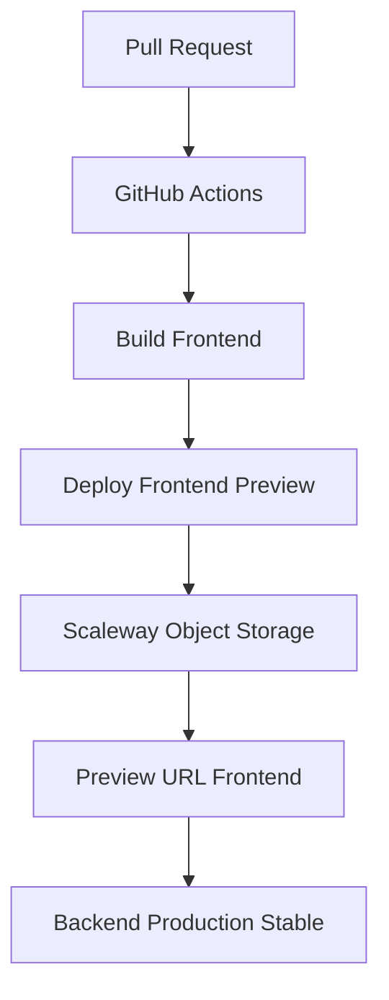

# Guide d'Automatisation des Previews Frontend avec GitHub Actions et Scaleway

## 1. Vue d'ensemble de l'architecture

Cette solution permet d'automatiser le déploiement de previews frontend pour chaque Pull Request, hébergées sur Scaleway Object Storage et communiquant avec votre backend stable en production.

### Architecture simplifiée



## 2. Configuration GitHub Actions

### Workflow pour les previews frontend

Créez `.github/workflows/preview-frontend.yml` :

```yaml
name: Frontend Preview Deployment

on:
  pull_request:
    types: [opened, synchronize, reopened, closed]
    paths:
      - 'src/**'
      - 'public/**'
      - 'package.json'
      - 'vite.config.ts'

env:
  SCW_ACCESS_KEY: ${{ secrets.SCW_ACCESS_KEY }}
  SCW_SECRET_KEY: ${{ secrets.SCW_SECRET_KEY }}
  SCW_DEFAULT_ORGANIZATION_ID: ${{ secrets.SCW_DEFAULT_ORGANIZATION_ID }}
  SCW_DEFAULT_PROJECT_ID: ${{ secrets.SCW_DEFAULT_PROJECT_ID }}
  SCW_DEFAULT_REGION: fr-par
  SCW_DEFAULT_ZONE: fr-par-1

jobs:
  deploy-preview:
    runs-on: ubuntu-latest
    if: github.event.action != 'closed'
    steps:
      - name: Checkout
        uses: actions/checkout@v4

      - name: Setup Node.js
        uses: actions/setup-node@v4
        with:
          node-version: '18'
          cache: 'npm'

      - name: Install dependencies
        run: npm ci

      - name: Build application
        run: |
          export VITE_API_URL=https://api.skillquest.com  # Votre backend stable
          export VITE_APP_ENV=preview
          npm run build

      - name: Install Scaleway CLI
        run: |
          curl -o /usr/local/bin/scw -L "https://github.com/scaleway/scaleway-cli/releases/latest/download/scaleway-cli_$(uname -s | tr '[:upper:]' '[:lower:]')_$(uname -m | sed 's/x86_64/amd64/')"
          chmod +x /usr/local/bin/scw

      - name: Create S3 bucket for preview
        run: |
          BUCKET_NAME="skillquest-pr-${{ github.event.number }}"
          scw object bucket create name=$BUCKET_NAME region=fr-par || true
          scw object bucket website set bucket=$BUCKET_NAME index-document=index.html error-document=404.html

      - name: Deploy to Scaleway Object Storage
        run: |
          BUCKET_NAME="skillquest-pr-${{ github.event.number }}"
          scw object cp dist/ s3://$BUCKET_NAME/ --recursive

      - name: Comment PR with preview URL
        uses: actions/github-script@v7
        with:
          script: |
            const prNumber = context.payload.pull_request.number;
            const previewUrl = `https://skillquest-pr-${prNumber}.s3-website.fr-par.scw.cloud`;
            
            github.rest.issues.createComment({
              issue_number: prNumber,
              owner: context.repo.owner,
              repo: context.repo.repo,
              body: `🚀 **Preview déployé avec succès !**\n\n📱 Frontend: ${previewUrl}\n🔗 Backend: https://api.skillquest.com (production stable)\n\n_Cette preview sera automatiquement supprimée à la fermeture de la PR._`
            });

  cleanup-preview:
    runs-on: ubuntu-latest
    if: github.event.action == 'closed'
    steps:
      - name: Install Scaleway CLI
        run: |
          curl -o /usr/local/bin/scw -L "https://github.com/scaleway/scaleway-cli/releases/latest/download/scaleway-cli_$(uname -s | tr '[:upper:]' '[:lower:]')_$(uname -m | sed 's/x86_64/amd64/')"
          chmod +x /usr/local/bin/scw

      - name: Delete preview bucket
        run: |
          BUCKET_NAME="skillquest-pr-${{ github.event.number }}"
          scw object object delete s3://$BUCKET_NAME/ --recursive || true
          scw object bucket delete name=$BUCKET_NAME || true
```


## 3. Configuration Scaleway

### 3.1 Object Storage pour le Frontend

1. **Créer un bucket Object Storage** :
   ```bash
   # Via CLI Scaleway
   scw object bucket create name=skillquest-previews region=fr-par
   ```

2. **Configurer les permissions** :
   - Activer l'hébergement web statique
   - Configurer les CORS pour votre domaine de production

3. **Configuration CORS** :
   Assurez-vous que votre backend de production accepte les requêtes depuis les URLs de preview :
   ```json
   {
     "allowedOrigins": [
       "https://skillquest.com",
       "https://*.skillquest.scaleway.io"
     ]
   }
   ```

## 4. Variables d'environnement et secrets

### 4.1 Secrets GitHub requis

Ajoutez ces secrets dans votre repository GitHub (`Settings > Secrets and variables > Actions`) :

```
SCALEWAY_ACCESS_KEY=your_access_key
SCALEWAY_SECRET_KEY=your_secret_key
SCALEWAY_DEFAULT_ORGANIZATION_ID=your_org_id
SCALEWAY_BUCKET_NAME=skillquest-previews
```

### 4.2 Configuration des variables d'environnement

**Frontend** :
- `VITE_API_URL` : URL de votre API backend de production
- `VITE_APP_ENV` : `preview` pour les previews

**Backend de production** :
Assurez-vous que votre backend accepte les requêtes CORS depuis les URLs de preview.

## 5. Communication Frontend-Backend

### 5.1 Configuration simplifiée des URLs

**Frontend** :
```javascript
// config/api.js
const getApiUrl = () => {
  // Pour les previews, on utilise toujours le backend de production
  return import.meta.env.VITE_API_URL || 'https://api.skillquest.com';
};

export const API_BASE_URL = getApiUrl();
```

### 5.2 Gestion des environnements

```javascript
// utils/environment.js
export const isPreview = () => {
  return import.meta.env.VITE_APP_ENV === 'preview';
};

export const getEnvironmentConfig = () => {
  return {
    apiUrl: API_BASE_URL,
    environment: import.meta.env.VITE_APP_ENV || 'production',
    debug: isPreview() || import.meta.env.DEV,
    isPreviewMode: isPreview()
  };
};
```

### 5.3 Configuration CORS côté backend

Assurez-vous que votre backend de production accepte les requêtes depuis les URLs de preview :

```javascript
// Dans votre backend de production
app.use(cors({
  origin: [
    'https://skillquest.com',
    'https://www.skillquest.com',
    /^https:\/\/pr-\d+\.skillquest\.scaleway\.io$/  // Accepter les previews
  ],
  credentials: true
}));
```

## 6. Avantages de cette approche simplifiée

### 6.1 Simplicité de configuration

- **Moins de ressources** : Pas besoin de gérer des containers backend pour chaque PR
- **Configuration unique** : Un seul workflow GitHub Actions à maintenir
- **Déploiement rapide** : Build et déploiement frontend uniquement

### 6.2 Économies de coûts

- **Pas de containers multiples** : Économie sur les ressources Scaleway
- **Backend stable** : Utilisation optimisée du backend de production
- **Stockage minimal** : Seuls les assets frontend sont stockés

### 6.3 Maintenance réduite

- **Moins de complexité** : Pas de gestion de base de données de test
- **Stabilité** : Backend de production testé et stable
- **Nettoyage simple** : Suppression des fichiers statiques uniquement

## 7. Guide d'implémentation étape par étape

### Étape 1 : Configuration Scaleway

1. **Créer le bucket Object Storage** :
   ```bash
   # Object Storage pour les previews frontend
   scw object bucket create name=skillquest-previews region=fr-par
   ```

2. **Configurer l'hébergement web** :
   - Activer l'hébergement web statique sur le bucket
   - Configurer `index.html` comme page d'index

3. **Générer les clés API** :
   ```bash
   scw iam api-key create
   ```

### Étape 2 : Configuration GitHub

1. **Ajouter les secrets** dans `Settings > Secrets and variables > Actions` :
   - `SCALEWAY_ACCESS_KEY`
   - `SCALEWAY_SECRET_KEY`
   - `SCALEWAY_DEFAULT_ORGANIZATION_ID`
   - `SCALEWAY_BUCKET_NAME`

2. **Créer le workflow** `.github/workflows/preview-frontend.yml`

### Étape 3 : Adaptation du code frontend

1. **Configuration API** : Pointer vers le backend de production
2. **Variables d'environnement** : Configurer `VITE_API_URL`
3. **Gestion des environnements** : Ajouter la détection du mode preview

### Étape 4 : Configuration backend (production)

1. **CORS** : Accepter les requêtes depuis les URLs de preview
2. **Monitoring** : Optionnel, surveiller les requêtes des previews

### Étape 5 : Test et validation

1. **Créer une PR de test**
2. **Vérifier le déploiement automatique**
3. **Tester la communication avec le backend de production**
4. **Valider le nettoyage automatique à la fermeture de la PR

## 8. Dépannage et FAQ

### Problèmes courants

**Q: Le frontend preview ne peut pas communiquer avec le backend de production**
- Vérifiez la configuration CORS du backend de production
- Contrôlez que `VITE_API_URL` pointe vers la bonne URL
- Testez l'URL de l'API manuellement depuis le navigateur

**Q: Le déploiement frontend échoue**
- Vérifiez les secrets GitHub (clés Scaleway)
- Contrôlez les permissions sur le bucket Object Storage
- Examinez les logs du workflow GitHub Actions

**Q: Les previews ne se suppriment pas automatiquement**
- Vérifiez que le workflow de cleanup s'exécute bien
- Contrôlez les permissions de suppression sur le bucket
- Nettoyez manuellement les anciens fichiers si nécessaire

**Q: Erreur CORS lors des requêtes API**
- Ajoutez le pattern des URLs de preview dans la configuration CORS du backend
- Vérifiez que les credentials sont correctement configurés

### Commandes utiles

```bash
# Lister les objets dans le bucket de previews
scw object object list bucket-name=skillquest-previews

# Supprimer manuellement une preview
scw object object delete bucket-name=skillquest-previews object-key=pr-123/

# Vérifier la configuration du bucket
scw object bucket get name=skillquest-previews
```

### Optimisations possibles

- **Cache des dépendances** : Utiliser le cache npm dans GitHub Actions
- **Build incrémental** : Optimiser les temps de build
- **CDN** : Ajouter un CDN devant Object Storage pour de meilleures performances
- **Compression** : Activer la compression gzip sur les assets

## 9. Optimisations et bonnes pratiques

### Cache des dépendances

```yaml
# Optimisation du cache dans le workflow
- name: Cache dependencies
  uses: actions/cache@v3
  with:
    path: |
      ~/.npm
      node_modules
    key: ${{ runner.os }}-node-${{ hashFiles('**/package-lock.json') }}
    restore-keys: |
      ${{ runner.os }}-node-
```

### Déploiement conditionnel

```yaml
# Déployer seulement si des fichiers frontend ont changé
- name: Check for frontend changes
  uses: dorny/paths-filter@v2
  id: frontend-changes
  with:
    filters: |
      frontend:
        - 'src/**'
        - 'public/**'
        - 'package.json'
        - 'vite.config.js'

- name: Deploy frontend preview
  if: steps.frontend-changes.outputs.frontend == 'true'
  # ... étapes de déploiement frontend
```

### Notifications

```yaml
# Notification en cas d'échec
- name: Comment on failure
  if: failure()
  uses: actions/github-script@v7
  with:
    script: |
      github.rest.issues.createComment({
        issue_number: context.issue.number,
        owner: context.repo.owner,
        repo: context.repo.repo,
        body: '❌ **Échec du déploiement de la preview**\n\nVeuillez vérifier les logs du workflow.'
      });
```

## 10. Conclusion

Cette solution simplifiée vous permet de :

✅ **Automatiser les previews frontend** pour chaque Pull Request  
✅ **Économiser les ressources** en utilisant le backend de production  
✅ **Simplifier la maintenance** avec une seule configuration  
✅ **Accélérer les déploiements** avec des builds frontend uniquement  
✅ **Réduire les coûts** en évitant les containers backend multiples  

### Avantages spécifiques pour SkillQuest

- **Backend stable** : Votre API de production est testée et fiable
- **Développement frontend** : Focus sur les modifications UI/UX
- **Collaboration améliorée** : Previews rapides pour validation
- **Déploiement simplifié** : Moins de complexité technique

### Prochaines étapes

1. **Configurez Scaleway Object Storage** avec les permissions appropriées
2. **Ajoutez les secrets GitHub** pour l'authentification Scaleway
3. **Créez le workflow** `.github/workflows/preview-frontend.yml`
4. **Testez avec une PR** pour valider le fonctionnement
5. **Ajustez la configuration CORS** de votre backend si nécessaire

### Ressources utiles

- [Documentation Scaleway Object Storage](https://www.scaleway.com/en/docs/storage/object/)
- [GitHub Actions Documentation](https://docs.github.com/en/actions)
- [Scaleway CLI Documentation](https://github.com/scaleway/scaleway-cli)
- [Configuration CORS Express.js](https://expressjs.com/en/resources/middleware/cors.html)

Cette configuration vous permet d'avoir un système complet de preview automatique pour chaque Pull Request, avec communication sécurisée entre frontend et backend
